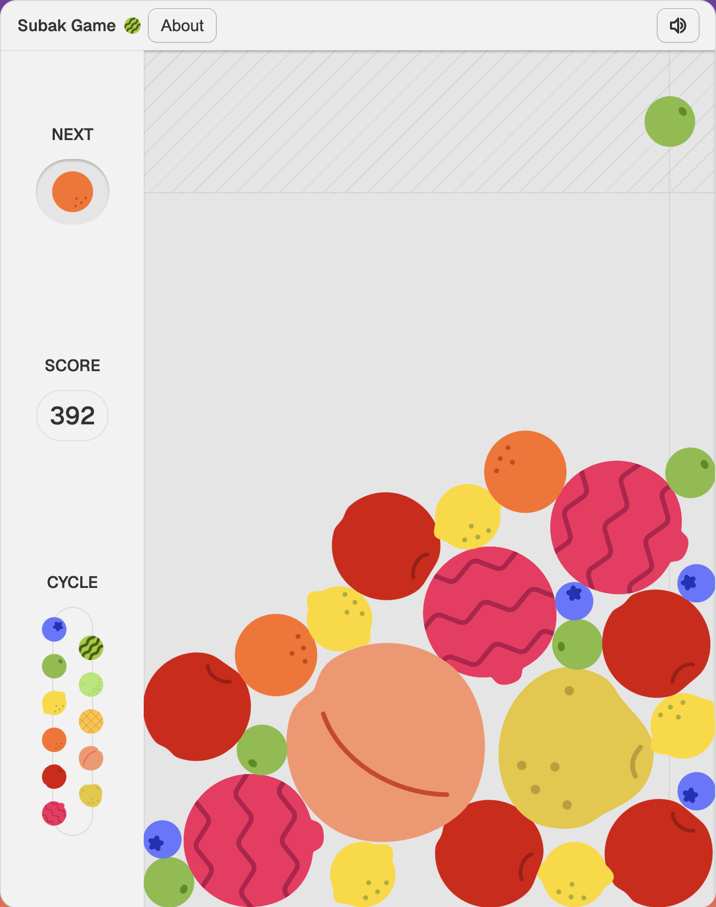

# Subak Game 🍉


A browser-based fruit-merging puzzle game inspired by [Suika Game](https://www.nintendo.com/us/store/products/suika-game-switch/). Drop fruits into a container — when two identical fruits touch, they merge into the next fruit in the evolution chain. Combine your way up through **11 fruits** (blueberry → grape → lemon → orange → apple → dragonfruit → pear → peach → pineapple → honeydew → watermelon) and chase the highest score.

The original game, "Merge Big Watermelon" (合成大西瓜), was created by Meadow Science (米兜科技). This project was built as a fun memento of a team off-site where I accidentally got my entire team hooked on Suika Game. "Subak" (수박) is Korean for watermelon.

**Play it live → [subak.kempf.dev](https://subak.kempf.dev)**

---

## Gameplay



- **Drop** a fruit anywhere along the top of the container.
- **Merge** — when two identical fruits collide, they fuse into the next-larger fruit and award points.
- **Game over** when any fruit breaches the danger line at the top.
- Scores are saved locally (IndexedDB) and optionally submitted to a global leaderboard.

---

## Architecture

The project serves two roles:

| Mode | Description |
|---|---|
| **Standalone app** | A full SvelteKit single-page app deployed as a static site via `@sveltejs/adapter-static`. |
| **Embeddable library** | Published as an npm package exporting a `SubakGame` Svelte component (`import { SubakGame } from 'subak-game'`). |

### Key modules

```
src/
├── lib/
│   ├── api/                  # LeaderboardClient — reactive Svelte 5 class managing
│   │                         #   session tokens, score submission, and global score fetching
│   ├── components/           # UI layer (Game, Leaderboard, modals, merge effects, etc.)
│   ├── game/                 # Physics-layer classes
│   │   ├── Fruit.ts          #   Fruit rigid-body wrapper (Rapier colliders, merging)
│   │   ├── Boundary.ts       #   Wall / floor collider creation
│   │   └── AudioManager.svelte.ts  #   Sound effect management via Howler
│   ├── hooks/                # Reactive utilities (useBoundingRect, useCursorPosition)
│   ├── stores/
│   │   ├── game.svelte.ts    #   Core GameState class — physics loop, collision detection,
│   │   │                     #   score tracking, fruit spawning, game-over logic
│   │   ├── db.ts             #   Local high-score persistence (Dexie / IndexedDB)
│   │   └── telemetry.svelte.ts  #   Session telemetry & anti-cheat payload builder
│   ├── icons/ & svg/         # Inline SVG fruit sprites and UI icons
│   └── types/                # Shared TypeScript interfaces
├── routes/                   # SvelteKit page entry point
└── utils/                    # Web analytics (PostHog) initializer
```

---

## Tech Stack

| Layer | Tool | Why |
|---|---|---|
| **UI** | [Svelte 5](https://svelte.dev) | Fine-grained reactivity via `$state` runes, minimal runtime overhead |
| **Physics** | [Rapier (rapier2d-compat)](https://rapier.rs) | WASM-powered 2D rigid-body simulation with deterministic collision events |
| **Audio** | [Howler](https://howlerjs.com) | Cross-browser sound playback with volume and pitch control |
| **Local storage** | [Dexie](https://dexie.org) | Ergonomic IndexedDB wrapper for persisting local high scores |
| **Screenshots** | [modern-screenshot](https://github.com/nicepkg/modern-screenshot) | DOM-to-image capture for sharing game-over screens |
| **Telemetry** | [PostHog](https://posthog.com) | Optional web analytics |
| **Build** | [Vite](https://vite.dev) + [SvelteKit](https://svelte.dev/docs/kit) | Fast HMR, SSG via `adapter-static`, library mode via `svelte-package` |
| **Linting** | [Biome](https://biomejs.dev) | Formatting and linting in a single tool |
| **Testing** | [Vitest](https://vitest.dev) (browser mode) + [Playwright](https://playwright.dev) | Real-browser test execution with `@testing-library/svelte` |
| **Type checking** | [TypeScript](https://typescriptlang.org) + `svelte-check` | Full strict-mode type safety across `.ts` and `.svelte` files |

---

## Prerequisites

- **Node.js** ≥ 18
- **npm** ≥ 9

---

## Getting Started

### 1. Clone and install

```bash
git clone https://github.com/Fauntleroy/subak-game.git
cd subak-game
npm install
```

### 2. Configure environment

```bash
cp .env.example .env
```

| Variable | Purpose | Default |
|---|---|---|
| `VITE_APP_VERSION` | Injected build version | `$npm_package_version` |
| `VITE_POSTHOG_TOKEN` | PostHog analytics token (optional) | — |
| `PUBLIC_SHARED_CLIENT_SALT` | Shared salt for anti-cheat hash | `"public_secret_hash_salt"` |
| `PUBLIC_LEADERBOARD_URL` | Leaderboard API base URL | `http://localhost:3001` |

> **Leaderboard is optional.** The game runs fully offline — the leaderboard client gracefully handles missing or unavailable servers.

### 3. Run the dev server

```bash
npm run dev
```

Open **http://localhost:4032** (port `4032` = PLU code of 수박 🍉).

---

## Scripts

| Command | Description |
|---|---|
| `npm run dev` | Start Vite dev server with HMR |
| `npm run build` | Production build → `build/` (static site) + `dist/` (library package) |
| `npm run preview` | Preview the production build locally |
| `npm run check` | Run `svelte-check` for type errors |
| `npm run lint` | Lint with Biome |
| `npm run format` | Auto-format with Biome |
| `npm run test` | Run Vitest (browser mode, headless Chromium) |
| `npm run test:watch` | Run Vitest in watch mode |
| `npm run validate` | **Full CI gate** — format → lint → test → check |

---

## Testing

Tests run in **Vitest browser mode** using Playwright (headless Chromium) for real DOM and browser API access.

```bash
npm run test            # single run
npm run test:watch      # watch mode
```

Test files live alongside their source code in `__tests__/` directories, covering components, game engine classes, stores, and hooks.

---

## Building & Deployment

### Static site (GitHub Pages)

```bash
npm run build
```

The SvelteKit static adapter outputs to `build/`. The `docs/` directory contains a pre-built snapshot served via GitHub Pages at **[subak.kempf.dev](https://subak.kempf.dev)**.

### Library package

```bash
npm run prepack
```

Outputs the publishable Svelte component library to `dist/`. Consumers import the game as:

```svelte
<script>
  import { SubakGame } from 'subak-game';
</script>

<SubakGame />
```

---

## Leaderboard Server

The game connects to an optional companion leaderboard API ([`subak-leaderboard`](https://github.com/Fauntleroy/subak-leaderboard)) for global score tracking. Set `PUBLIC_LEADERBOARD_URL` in `.env` to point to a running instance. See the leaderboard repo for setup instructions.

---

## Project Structure

```
subak-game/
├── src/
│   ├── lib/              # Core library — components, game engine, stores, hooks
│   ├── routes/           # SvelteKit app entry point
│   └── utils/            # Web analytics setup
├── static/               # Static assets (images, sounds, favicon)
├── design/               # Source design files (Affinity Designer)
├── docs/                 # Pre-built static site for GitHub Pages
├── dist/                 # Compiled library package output
├── biome.json            # Biome linter/formatter config
├── svelte.config.js      # SvelteKit config (static adapter)
├── vite.config.ts        # Vite config (dev server, build)
├── vitest.config.ts      # Vitest config (browser mode, Playwright)
└── tsconfig.json         # TypeScript config
```

---

## Contributing

Contributions are welcome! If you have ideas for improvements, new features, or bug fixes, feel free to open an issue or submit a pull request.

---

## License

This project is licensed under the **Creative Commons Attribution-NonCommercial 4.0 International License** (CC BY-NC 4.0). See [LICENSE.md](LICENSE.md) for details.
